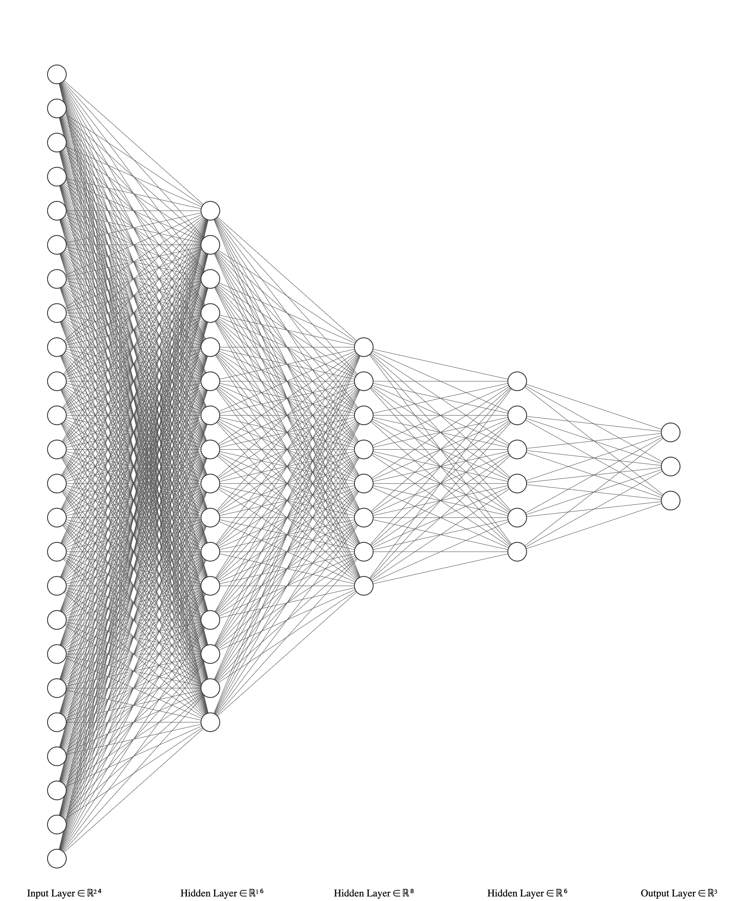

# Genetic Snake

## Introduction

Neural Network와 Genetic Algorithm을 활용하여 만든 Snake Game AI 입니다.  

신경망 구조는 다음과 같습니다.  

벽, 자신의 꼬리, 먹이에 대해 **각각 8개의 방향, 총 24개의 거리 정보를 입력** 받고, 이를 바탕으로 **3개의 방향으로의 이동을 결정**합니다. Numpy 라이브러리를 활용하여 신경망을 만들었으며 Genetic Algorithm에 따라 가중치를 조절합니다.

[Kairess님의 "Genetic_snake" 깃허브 레포지터리](https://github.com/kairess/genetic_snake) 를 기본으로 하여 더 좋은 성능을 위해 8개의 방향으로 정보를 입력받도록 수정하였으며, Cross Over 함수, Neural Network 구조 등에서 다양한 수정을 가해 만들었습니다.

또한 기존과 다르게 칸수가 10 X 10 으로 바뀐 것을 확인 할 수 있는데, 이것은 Snake가 좁은 공간에서 **처음부터 꼬리에 부딪히는 것에 적응**해 나가도록 하기 위해 정한 것 입니다.

## Problems
1. 학습속도가 기존에 비해 느립니다.
2. 뱀이 생존을 잘 할수록 한 세대당 걸리는 시간이 굉장히 늘어납니다.

## Solution
1. 망 구조, 함수 등에서 다양한 수정을 가할 것 입니다.
2. 실제로 뱀을 이동시키지 않고 학습을 한 후 마지막에 모델을 적용하는 방식으로 수정할 것 입니다.  
**인터넷에 수학 이론 검색하면서 만든 첫 Neural Network 이자 첫 Genetic Algorithm 프로젝트 이기 때문에 수정할 점이 많을 수 있습니다! 아낌없는 잔소리와 PR을 날려주세요!!**

## Credits

- [Kairess님의 "Genetic_snake" 깃허브 레포지터리](https://github.com/kairess/genetic_snake)  
- [Chrispresso님의 "AI Learns to play Snake!" 영상](https://www.youtube.com/watch?v=vhiO4WsHA6c&ab_channel=Chrispresso)
